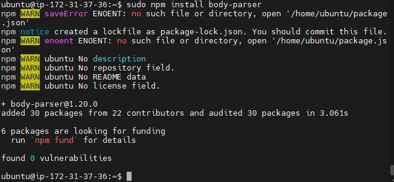

### MEAN STACK DEPLOYMENT TO UBUNTU IN AWS

The last 3 projects I deployed LAMP,LEMP and MEARN Web stack. In this project I will be deploying MEAN stack on to Ubuntu Server.

### PREREQUISITES:
AWS Free tier account
EC2 instance of t2.nano with Ubuntu Server 20.04LTS(HVM) image. 
Installing and configuring NodeJS, MongoDB, Express JS.
Update firewall : create inbound rule for TCP port 3300

### TASK

In this project I'm going to implement a simple Book Register web form using MEAN stack.

I will be using MobaXterm to connect to my instance....Lets begin:

### STEP 1: INSTALL NodeJs

Node.js is a JavaScript runtime built on Chrome’s V8 JavaScript engine. Node.js is used in this tutorial to set up the Express routes and AngularJS controllers.

Update ubuntu

<code>sudo apt update</code>

Upgrade ubuntu

<code>sudo apt upgrade</code>

Add certificates

<code>sudo apt -y install curl dirmngr apt-transport-https lsb-release ca-certificates

curl -sL https://deb.nodesource.com/setup_12.x | sudo -E bash -
</code>

Install NodeJS

<code>sudo apt install -y nodejs</code>

### STEPS 2: Install MongoDB

MongoDB stores data in flexible, JSON-like documents. Fields in a database can vary from document to document and data structure can be changed over time. 

For our example application, we are adding book records to MongoDB that contain book name, isbn number, author, and number of pages.
mages/WebConsole.gif

<code>
sudo apt-key adv --keyserver hkp://keyserver.ubuntu.com:80 --recv 0C49F3730359A14518585931BC711F9BA15703C6
</code>

---

<code>
echo "deb [ arch=amd64 ] https://repo.mongodb.org/apt/ubuntu trusty/mongodb-org/3.4 multiverse" | sudo tee /etc/apt/sources.list.d/mongodb-org-3.4.list
</code>

---

Install MongoDB

<code>sudo apt install -y mongodb</code>

Start The server

<code>sudo service mongodb start</code>

Verify that the service is up and running

<code>sudo systemctl status mongodb</code>

Install npm – Node package manager.

<code>sudo apt install -y npm</code>

Install body-parser package

We need ‘body-parser’ package to help us process JSON files passed in requests to the server.

<code>sudo npm install body-parser</code>

Create a folder named ‘Books’

<code>mkdir Books && cd Books</code>

In the Books directory, Initialize npm project

<code>npm init</code>

Give the book a title, enter an entry point, Author name and License. Type Yes and hit enter key to proceed

Add a file to it named server.js

<code>vi server.js</code>

Copy and paste the web server code below into the server.js file.

<code>
var express = require('express');
var bodyParser = require('body-parser');
var app = express();
app.use(express.static(__dirname + '/public'));
app.use(bodyParser.json());
require('./apps/routes')(app);
app.set('port', 3300);
app.listen(app.get('port'), function() {
    console.log('Server up: http://localhost:' + app.get('port'));
});
</code>

---
*Vim Text Editor*

### STEP 3: INSTALLING EXPRESS AND SET UP ROUTES TO THE SERVER

I'm going to install Express and setup routes to the server. Express is a minimal and flexible Node.js web application framework that provides feature for web and mobile applications.

Express will be used to pass book information to and from MongoDB database. Mongoose package which provides a straight-forward, schema-based solution to model your application data. We will use Mongoose to establish a schema for the database to store data of our book register.

<code>sudo npm install express mongoose</code>

In ‘Books’ folder, create a folder named apps

<code>mkdir apps && cd apps</code>

Create a file named routes.js

<code>vi routes.js</code>

Copy and paste the code below into routes.js

<code>
var Book = require('./models/book');
module.exports = function(app) {
  app.get('/book', function(req, res) {
    Book.find({}, function(err, result) {
      if ( err ) throw err;
      res.json(result);
    });
  }); 
  app.post('/book', function(req, res) {
    var book = new Book( {
      name:req.body.name,
      isbn:req.body.isbn,
      author:req.body.author,
      pages:req.body.pages
    });
    book.save(function(err, result) {
      if ( err ) throw err;
      res.json( {
        message:"Successfully added book",
        book:result
      });
    });
  });
  app.delete("/book/:isbn", function(req, res) {
    Book.findOneAndRemove(req.query, function(err, result) {
      if ( err ) throw err;
      res.json( {
        message: "Successfully deleted the book",
        book: result
      });
    });
  });
  var path = require('path');
  app.get('*', function(req, res) {
    res.sendfile(path.join(__dirname + '/public', 'index.html'));
  });
};
</code>

---

*vim routes.js* 

In the ‘apps’ folder, create a folder named models

<code>mkdir models && cd models</code>
Create a file named book.js

<code>vi book.js</code>

Copy and paste the code below into ‘book.js’

<code>
var mongoose = require('mongoose');
var dbHost = 'mongodb://localhost:27017/test';
mongoose.connect(dbHost);
mongoose.connection;
mongoose.set('debug', true);
var bookSchema = mongoose.Schema( {
  name: String,
  isbn: {type: String, index: true},
  author: String,
  pages: Number
});
var Book = mongoose.model('Book', bookSchema);
module.exports = mongoose.model('Book', bookSchema);
</code>

---

### STEP 4 – Access the routes with AngularJS

AngularJS provides a web framework for creating dynamic views in your web applications. In this tutorial, we use AngularJS to connect our web page with Express and perform actions on our book register.

Change the directory back to ‘Books’

<code>cd ../..</code>

Create a folder named public

<code>mkdir public && cd public</code>

Add a file named script.js

<code>vi script.js</code>

Copy and paste the Code below (controller configuration defined) into the script.js file.

<code>
var app = angular.module('myApp', []);
app.controller('myCtrl', function($scope, $http) {
  $http( {
    method: 'GET',
    url: '/book'
  }).then(function successCallback(response) {
    $scope.books = response.data;
  }, function errorCallback(response) {
    console.log('Error: ' + response);
  });
  $scope.del_book = function(book) {
    $http( {
      method: 'DELETE',
      url: '/book/:isbn',
      params: {'isbn': book.isbn}
    }).then(function successCallback(response) {
      console.log(response);
    }, function errorCallback(response) {
      console.log('Error: ' + response);
    });
  };
  $scope.add_book = function() {
    var body = '{ "name": "' + $scope.Name + 
    '", "isbn": "' + $scope.Isbn +
    '", "author": "' + $scope.Author + 
    '", "pages": "' + $scope.Pages + '" }';
    $http({
      method: 'POST',
      url: '/book',
      data: body
    }).then(function successCallback(response) {
      console.log(response);
    }, function errorCallback(response) {
      console.log('Error: ' + response);
    });
  };
});

</code>

---

In public folder, create a file named index.html;

<code>vi index.html</code>

Copy and paste the code below into index.html file.

*vi index.html*

Change the directory back up to Books

<code>cd ..</code>

Start the server by running this command:

<code>node server.js</code>

The server is now up and running, we can connect it via port 3300. You can launch a separate Putty or SSH console to test what curl command returns locally.

I would be using Microsoft Windows Terminal to SSH to instance 

<code>curl -s http://localhost:3300</code>

It shall return an HTML page, which difficult to read in the CLI, but we can also try and access it from the Internet.

For this – you need to open TCP port 3300 in your AWS Web Console for your EC2 Instance.

Now you can access our Book Register web application from the Internet with a browser using Public IP address or Public DNS name.

<code>https://http://3.8.186.42:3300/</code> into browser address.

Web Book Register Application

I have successfully created a simple Book Register! 

END...